# Data Streaming ETL & MLOps

## 1. Tổng quan dự án

Dự án này trung vào việc xây dựng một hệ thống xử lý dữ liệu (ETL) theo thời gian thực và một nền tảng MLOps hoàn chỉnh. Hệ thống thu thập dữ liệu từ nhiều nguồn, xử lý và làm giàu dữ liệu, sau đó sử dụng dữ liệu này để huấn luyện, triển khai và giám sát các mô hình học máy. Mục tiêu là cung cấp các dự đoán hoặc đề xuất theo thời gian thực, đồng thời quản lý hiệu quả toàn bộ vòng đời của mô hình.

## 2. Kiến trúc hệ thống

Hệ thống được thiết kế dựa trên kiến trúc microservices, sử dụng Docker và Docker Compose để quản lý các container. Sơ đồ kiến trúc tổng quan:

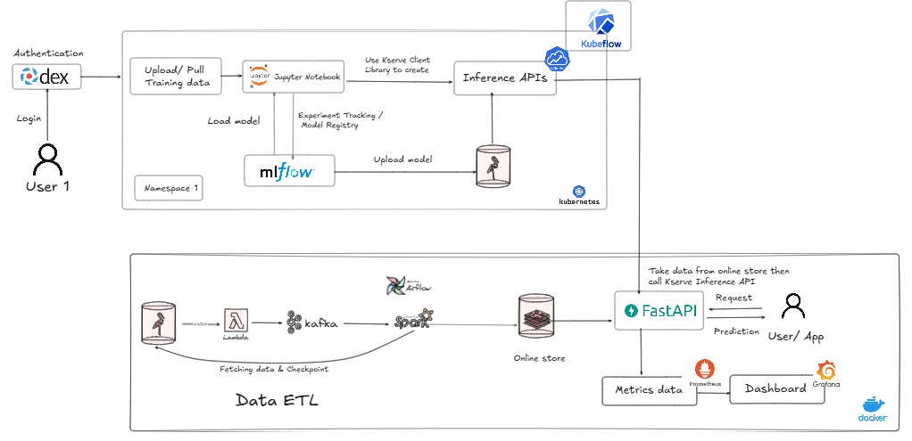
*Sơ đồ kiến trúc tổng quan của hệ thống Data Streaming ETL & MLOps.*

### Các công nghệ sử dụng chính:

**Data Pipeline (Luồng dữ liệu):**
*   **MinIO**: Đóng vai trò là datalake, nơi tập trung dữ liệu thô đa nguồn từ quá trình *Extract*. Tự động tạo buckets `bronze` và `storage`, đồng thời cấu hình event notification từ bucket `bronze` tới Kafka.
*   **Kafka & Confluent Platform**: Hệ thống message broker, tiếp nhận và phân phối sự kiện dữ liệu theo thời gian thực.
*   **Apache Airflow**: Điều phối và lập lịch cho các luồng xử lý dữ liệu (DAGs).
*   **Apache Spark**: Xử lý dữ liệu phân tán theo lô và thời gian thực (Spark Streaming) để chuyển đổi và làm giàu dữ liệu. Trong phạm vi dự án, hướng tới xây dựng quy trình dữ liệu ETL theo thời gian, Spark Stream được sử dụng.
*   **PostgreSQL**: Lưu trữ dữ liệu có cấu trúc sau xử lý, metadata cho Airflow và MLflow.
*   **Redis**: Lưu trữ key-value cho dữ liệu cần truy cập nhanh, phục vụ cho các ứng dụng thời gian thực và lưu trữ kết quả xử lý từ Spark.

**MLOps & Model Lifecycle (Huấn luyện, Triển khai và Giám sát Mô hình):**
*   **MLflow**: Quản lý vòng đời mô hình học máy (theo dõi thử nghiệm, đóng gói mô hình, đăng ký mô hình).
*   **Ray**: Framework phân tán cho huấn luyện mô hình học máy quy mô lớn, đặc biệt cho việc tinh chỉnh siêu tham số (hyperparameter tuning).
*   **FastAPI**: Xây dựng API hiệu suất cao cho việc phục vụ mô hình (model serving/inference).
*   **Prometheus**: Thu thập metrics từ các dịch vụ, bao gồm cả inference API để giám sát hiệu suất.
*   **Grafana**: Trực quan hóa metrics và giám sát hệ thống thông qua các dashboards.

## 3. Yêu cầu hệ thống

*   **Docker Desktop** và **Docker Compose** (phiên bản mới nhất được khuyến nghị).
*   **Python 3.9+** cho việc chạy các script cục bộ (ví dụ: `data_source/load_to_source.py`).
    *   Các thư viện Python cần thiết cho script cục bộ (xem `requirements.txt` nếu có, hoặc cài đặt thủ công): `minio`, `pandas`, `pyarrow`.
*   **Hệ điều hành**: Windows (với PowerShell), macOS, hoặc Linux.
*   **Tài nguyên hệ thống**: Đủ RAM (khuyến nghị 16GB+), CPU (4 cores+), và dung lượng đĩa trống để chạy các Docker containers.
*   **Kết nối Internet**: Để tải Docker images và các dependencies (nếu chưa có sẵn local).

## 4. Cấu trúc thư mục dự án

```
realtime-data-streaming/
├── dags/                   # Định nghĩa các DAGs cho Apache Airflow (e.g., data_streaming.py)
├── data_source/            # Scripts (load_to_source.py) và dữ liệu nguồn (train_clean_small.csv)
├── images/                 # Hình ảnh sử dụng trong tài liệu README
├── jars/                   # Các file JARs dependencies đã tải sẵn cho Spark
├── monitoring/             # Cấu hình cho Prometheus (prometheus.yml) và Grafana
├── spark_app/              # Các ứng dụng Apache Spark (process_data_streaming.py)
├── serving/                # Mã nguồn cho Inference API (FastAPI - main.py)
├── docker-compose.yml      # Cấu hình chính cho các dịch vụ (Kafka, Spark, Airflow, Redis, etc.)
├── docker-compose-minio.yml # Cấu hình cho MinIO và setup tự động (buckets, event notifications)
├── docker-compose.ray.yaml # Cấu hình cho Ray (huấn luyện mô hình)
├── docker-compose.model-registry.yaml # Cấu hình cho MLflow (model registry)
├── README.md               # Tài liệu hướng dẫn này
└── requirements.txt        # Các Python dependencies chung cho môi trường cục bộ (nếu cần)
```

## 5. Hướng dẫn cài đặt và triển khai

### 5.1. Thiết lập ban đầu

1.  **Tạo Docker network chung:**
    Mở PowerShell hoặc terminal và chạy lệnh sau:
    ```powershell
    docker network create confluent
    ```
    *Lưu ý: Nếu network `confluent` đã tồn tại, lệnh này sẽ báo lỗi nhưng không ảnh hưởng đến các bước tiếp theo.*

2.  **Triển khai MinIO và cấu hình tự động:**
    Hệ thống MinIO sẽ được khởi tạo với các bucket `bronze` và `datasource`.
    ```powershell
    docker-compose -f docker-compose-minio.yml up -d
    ```
    *   Truy cập MinIO Web UI tại `http://localhost:9001`.
    *   **Credentials**: `minioadmin` / `minioadmin`.
    *   Kiểm tra các bucket đã tạo: `bronze`, `storage`.
        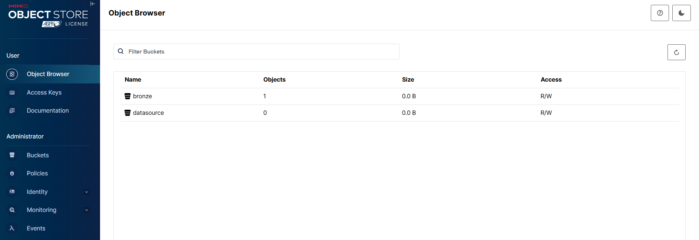
    *   Để tương tác với MinIO từ script bên ngoài Docker, cần tạo Access Keys thủ công và cập nhật vào `data_source/minio_config.py`. Điều này là bắt buộc cho các bước sau, khi các dịch vụ khác (Như Spark) cũng cần thông tin để có thể tải hay truy cập dữ liệu lưu trữ ở lake (*MinIO S3*) 
        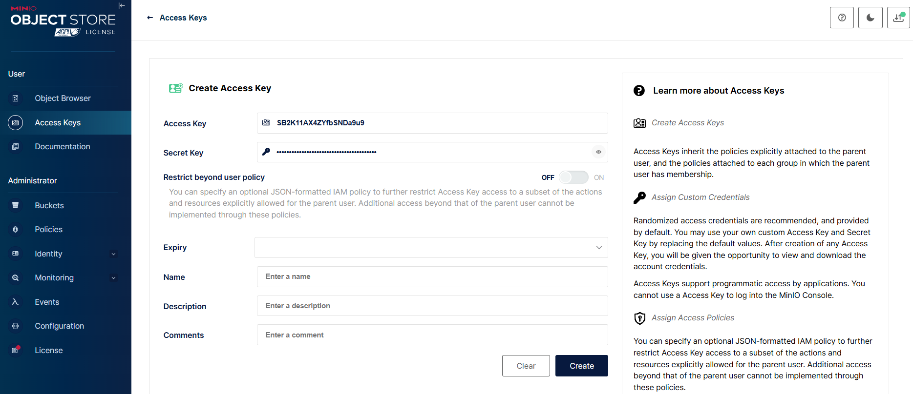

3.  **Chuẩn bị dữ liệu nguồn:**
    Chạy script để tải dữ liệu mẫu lên bucket `datasource` trên MinIO. Script này sẽ đọc dữ liệu, chuyển đổi thành JSON và tải lên MinIO.
    ```powershell
    python ./data_source/load_to_source.py
    ```
    Kiểm tra bucket `datasource` trên MinIO để xem các file JSON đã được tạo.
    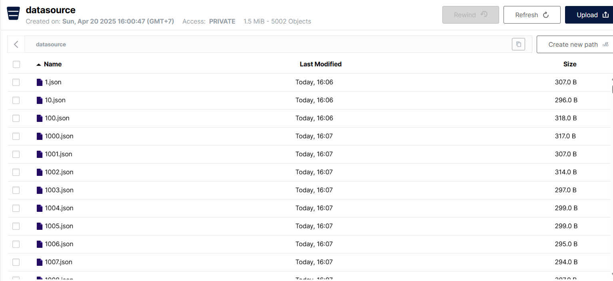

### 5.2. Khởi chạy các dịch vụ cốt lõi

1.  **Khởi động các dịch vụ chính:**
    Bao gồm Kafka, Zookeeper, Control Center, Airflow (webserver, scheduler), Spark (master, worker), PostgreSQL, và Redis.
    ```powershell
    docker-compose up -d
    ```
    *Ghi chú: Nếu cổng `8080` (mặc định cho Airflow) hay bất kỳ các cổng liên quan nào được sử dụng bởi các dịch vụ cho dự án đang được sử dụng bởi một ứng dụng khác, cần dừng tiến trình đó. Trên Windows, có thể sử dụng các lệnh sau trong PowerShell:*
    ```powershell
    netstat -aon | findstr ':8080'
    # Ghi lại PID từ cột cuối cùng
    taskkill /PID <PID_CUA_TIEN_TRINH> /F
    ```

2.  **Đảm bảo Airflow Scheduler hoạt động:**
    Scheduler có thể cần khởi động lại sau khi webserver đã sẵn sàng hoàn toàn.
    ```powershell
    docker-compose restart scheduler
    ```
    Hoặc nếu cần, ép khởi tạo lại container:
    ```powershell
    docker-compose up -d --force-recreate scheduler
    ```
    Truy cập các giao diện quản trị để kiểm tra:
    *   **Kafka Control Center**: `http://localhost:9021`
        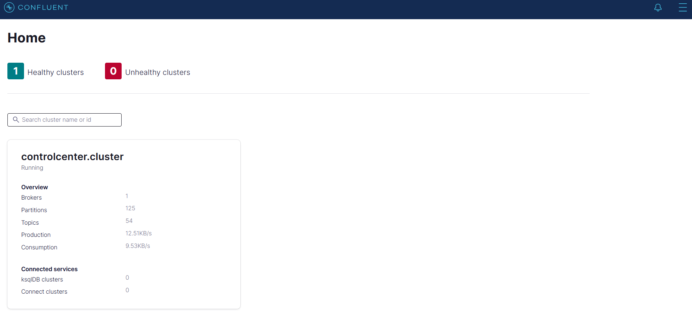
    *   **Apache Airflow**: `http://localhost:8080` (Credentials: `admin` / `admin`)
        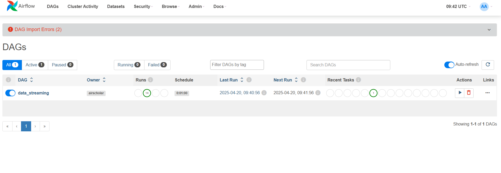

### 5.3. Luồng dữ liệu ETL (Data Streaming & Processing)

1.  **Xác minh cấu hình sự kiện MinIO (Tự động):**
    Cấu hình event notification từ bucket `bronze` sang Kafka topic `data_streaming`.
    Thiết lập cấu hình này trong MinIO UI:
    *   Đi tới Administrator → Events. Bạn sẽ thấy một destination trỏ đến Kafka. Sau đó nhấn vào và thiết lập như 2 hình dưới.
        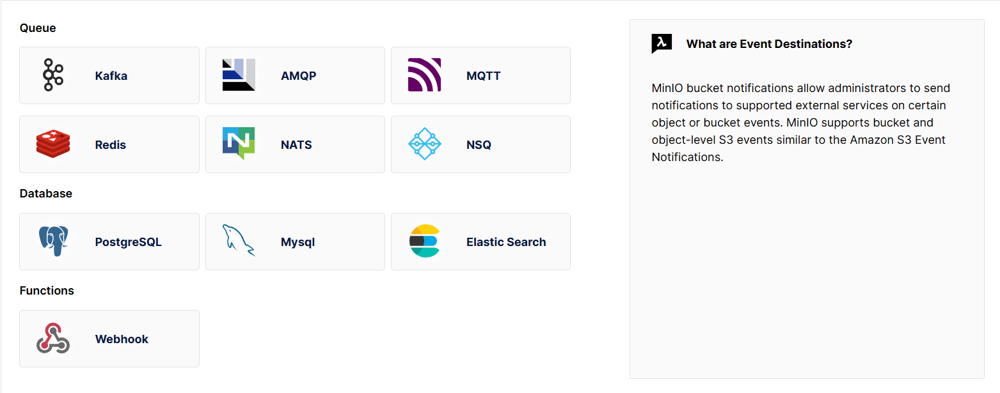 <!-- Hoặc data_streaming_event.png nếu phù hợp hơn -->
         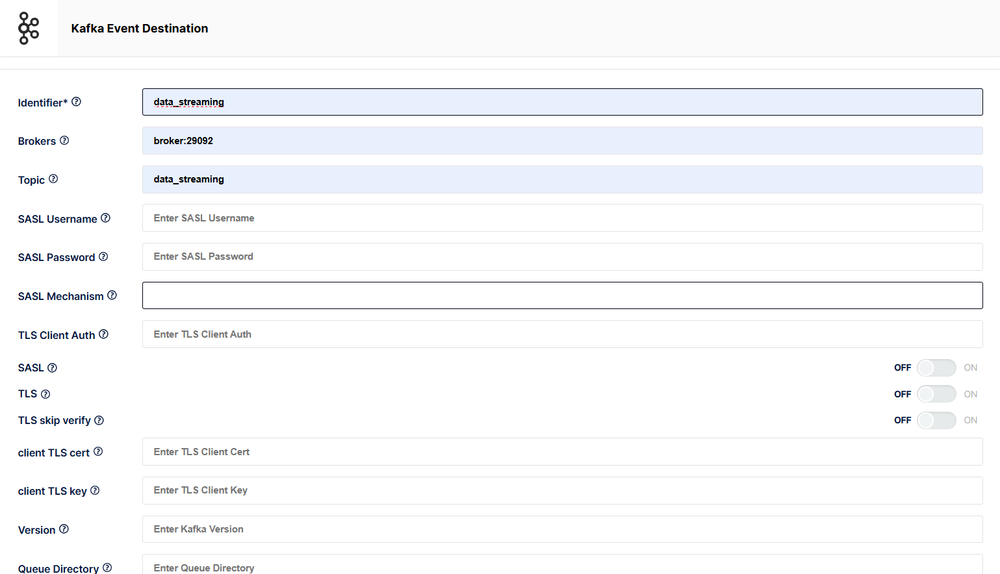 <!-- Tổng quan cấu hình event -->
    *   Đi tới Buckets → `bronze` → Events. Tiếp tục cấu hình tạo event `s3:ObjectCreated:Put` được đăng ký.
        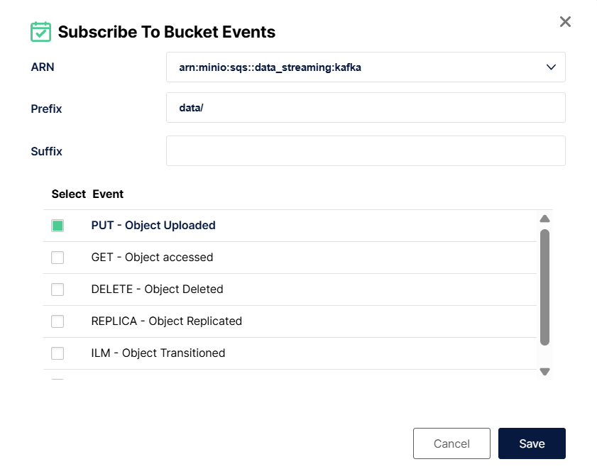
        <!-- Có thể sử dụng first_subscribe_event.png và second_subscribe_event.png nếu chúng minh họa các bước chi tiết hơn hoặc các khía cạnh khác của việc đăng ký event -->


2.  **Kích hoạt Data Streaming DAG trong Airflow:**
    *   Truy cập Airflow UI: `http://localhost:8080`.
    *   Tìm DAG có tên `data_streaming` (hoặc tên tương tự được định nghĩa trong `dags/`) và kích hoạt (Trigger) nó.
        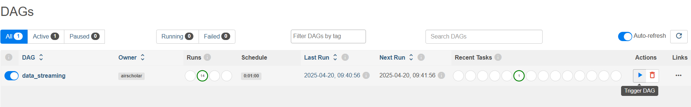
    *   DAG này thường sẽ thực hiện các tác vụ như đọc dữ liệu từ một nguồn (ví dụ: bucket `datasource` của MinIO) và ghi vào bucket `bronze` (ví dụ: `bronze/data/`). Việc ghi file mới vào `bronze` sẽ kích hoạt event notification đã cấu hình ở trên, đẩy message vào Kafka topic `data_streaming`.
    *   Kiểm tra Kafka Control Center (`http://localhost:9021`) để xem topic `data_streaming` và các message trong đó.
        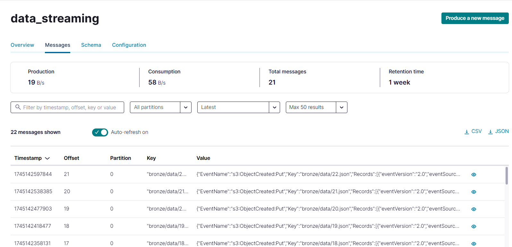

3.  **Chạy ứng dụng Spark để xử lý dữ liệu từ Kafka và lưu vào Redis:**
    *   Kết nối vào container Spark Master bằng PowerShell:
        ```powershell
        docker exec -it spark-master bash
        ```
    *   Bên trong container Spark Master, chạy ứng dụng Spark Streaming. Đường dẫn tới các file JARs đã được mount từ `./jars` trên máy host vào `/opt/spark_app/jars/` trong container.
        ```bash
        /opt/bitnami/spark/bin/spark-submit \
           --master spark://spark-master:7077 \
           --jars /opt/spark_app/jars/spark-sql-kafka-0-10_2.12-3.4.1.jar,/opt/spark_app/jars/hadoop-aws-3.3.4.jar,/opt/spark_app/jars/kafka-clients-3.3.2.jar,/opt/spark_app/jars/commons-pool2-2.11.1.jar,/opt/spark_app/jars/spark-token-provider-kafka-0-10_2.12-3.4.1.jar,/opt/spark_app/jars/postgresql-42.7.5.jar \
           /opt/spark_app/process_data_streaming.py
        ```
    *   Ứng dụng này sẽ:
        *   Đọc dữ liệu streaming từ Kafka topic `data_streaming`.
        *   Xử lý dữ liệu (transform, clean).
        *   Lưu kết quả vào Redis (ví dụ: sử dụng key format `user:{user_id}:product:{product_id}:session:{user_session}`).

4.  **Kiểm tra dữ liệu trong Redis:**
    *   Kiểm tra tổng số keys trong Redis:
        ```powershell
        docker exec -it redis redis-cli DBSIZE
        ```
    *   Kiểm tra một key cụ thể (thay `{user_id}`, `{product_id}`, `{user_session}` bằng giá trị thực tế):
        ```powershell
        docker exec -it redis redis-cli HGETALL "user:{user_id}:product:{product_id}:session:{user_session}"
        ```

### 5.4. Huấn luyện mô hình (ML Development & Training)

Phần này sử dụng Ray cho hyperparameter tuning và MLflow để theo dõi quá trình huấn luyện và quản lý mô hình.

1.  **Khởi động Ray và MLflow:**
    ```powershell
    docker-compose -f docker-compose.ray.yaml up -d
    docker-compose -f docker-compose.model-registry.yaml up -d
    ```

2.  **Truy cập các Dashboards:**
    *   **Ray Dashboard**: `http://localhost:8265/#/overview`
    *   **MLflow Dashboard**: `http://localhost:5001/`

3.  **Thực hiện huấn luyện:**
    <!-- *(Chi tiết về cách chạy các kịch bản huấn luyện cụ thể cần được bổ sung ở đây. Ví dụ: chạy một notebook Jupyter trong thư mục `notebook/` hoặc một script Python trong `dags/training_pipeline/` sử dụng Ray và log vào MLflow).*
    *Hiện tại, bạn có thể tham khảo các notebooks trong `notebook/` (ví dụ: `train.ipynb`) và các scripts trong `dags/training_pipeline/`.* -->

### 5.5. Triển khai và Giám sát (Production - Serving & Monitoring)

Sau khi có mô hình đã huấn luyện và đăng ký trong MLflow, triển khai API để phục vụ dự đoán và giám sát hiệu suất.

1.  **Khởi động Inference API, Prometheus, và Grafana:**
    Các dịch vụ này có thể đã được khởi động cùng với `docker-compose up -d` nếu chúng được định nghĩa trong file `docker-compose.yml` chính. Nếu không, có thể khởi động chúng riêng:
    ```powershell
    docker-compose up -d prometheus grafana inference-api
    ```
    *Lưu ý: Nếu `inference-api` gặp sự cố, bạn có thể khởi động riêng nó để xem logs chi tiết:*
    ```powershell
    docker-compose up -d inference-api
    docker-compose logs -f inference-api
    ```

2.  **Sử dụng Inference API:**
    *   Truy cập Swagger UI (tài liệu API tương tác): `http://localhost:8000/docs`
    *   Sử dụng endpoint `/predict` để gửi yêu cầu dự đoán. Ví dụ payload:
        ```json
        [
          { "user_id": 571535080, "product_id": 12300394 },
          { "user_id": 554617586, "product_id": 28713252 }
        ]
        ```
    *   Endpoint metrics của API (dùng cho Prometheus): `http://localhost:8000/metrics`

3.  **Giám sát với Prometheus và Grafana:**
    *   **Prometheus UI**: `http://localhost:9091`
        *   Xem các targets (ví dụ: `inference-api`) và trạng thái của chúng.
        *   Thực hiện truy vấn PromQL để xem metrics. Ví dụ: `rate(http_requests_total[5m])`.
        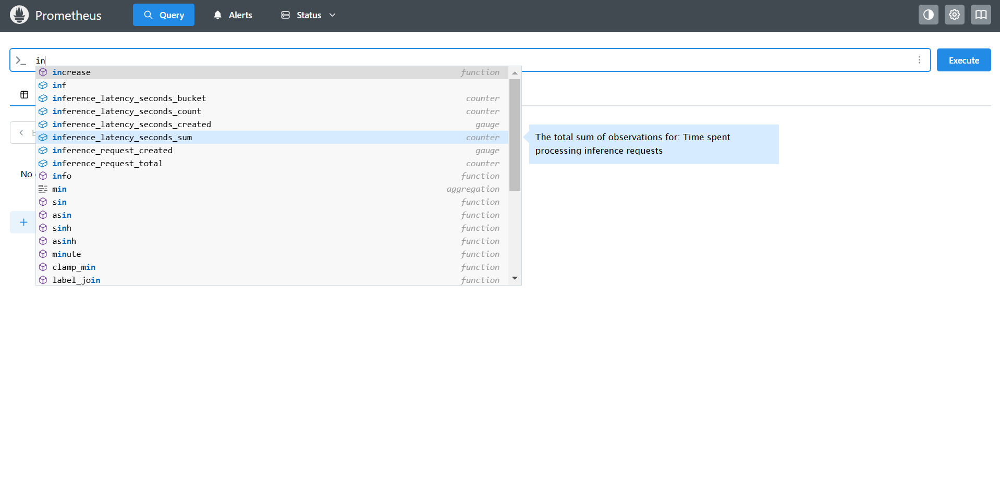
        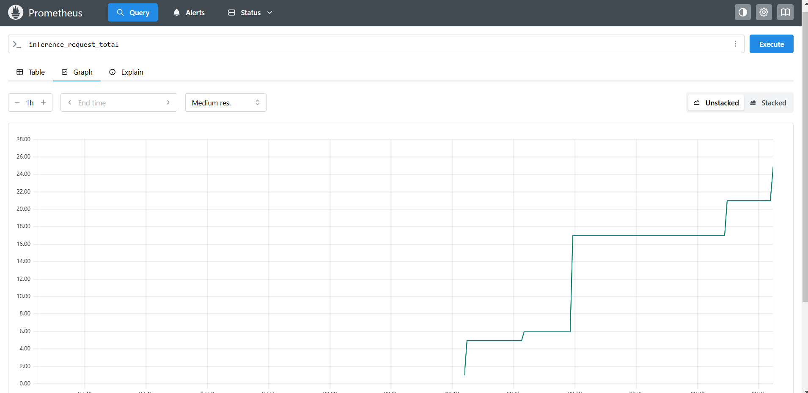
    *   **Grafana UI**: `http://localhost:3000` (Credentials: `admin` / `admin`)
        *   Đăng nhập. Prometheus Data Source thường đã được tự động provisioning từ `monitoring/grafana/provisioning/datasources/datasource.yml`.
            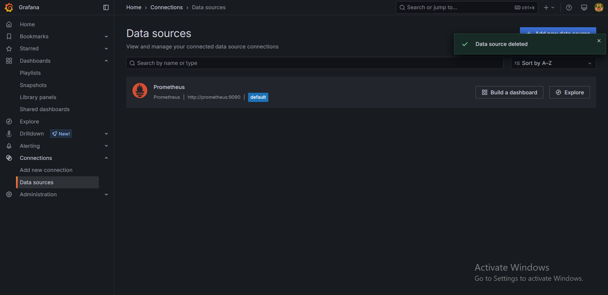
        *   Tạo Dashboards để trực quan hóa các metrics từ Prometheus.
            *   Vào Home, chọn "New dashboard" hoặc "Browse" để mở dashboard có sẵn.
                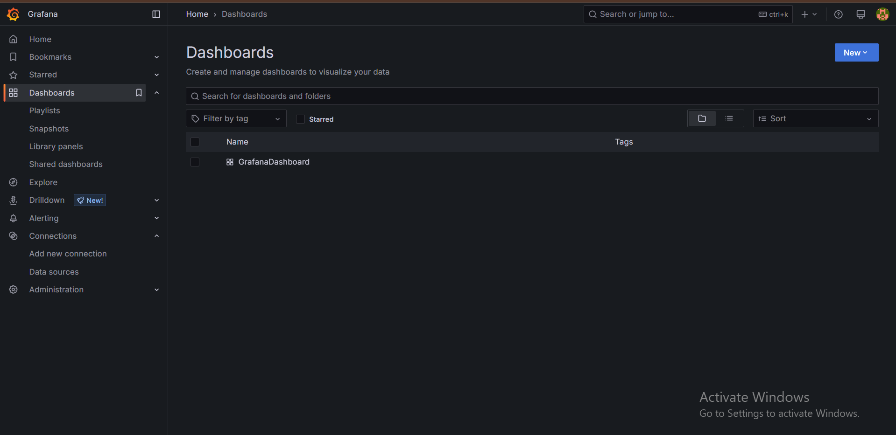
            *   Thêm panel mới ("Add visualization").
                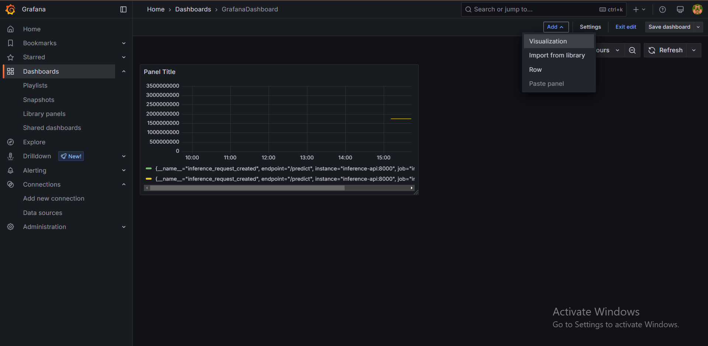
            *   Chọn Prometheus làm data source và xây dựng query để hiển thị metrics.
                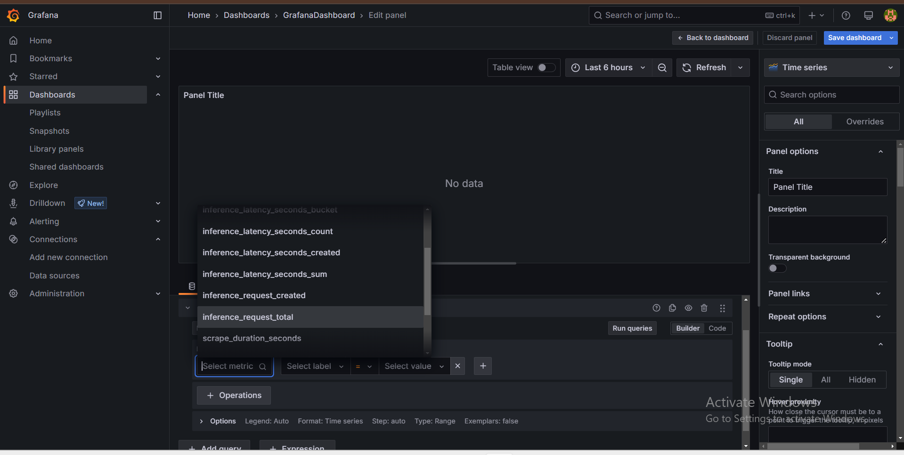
                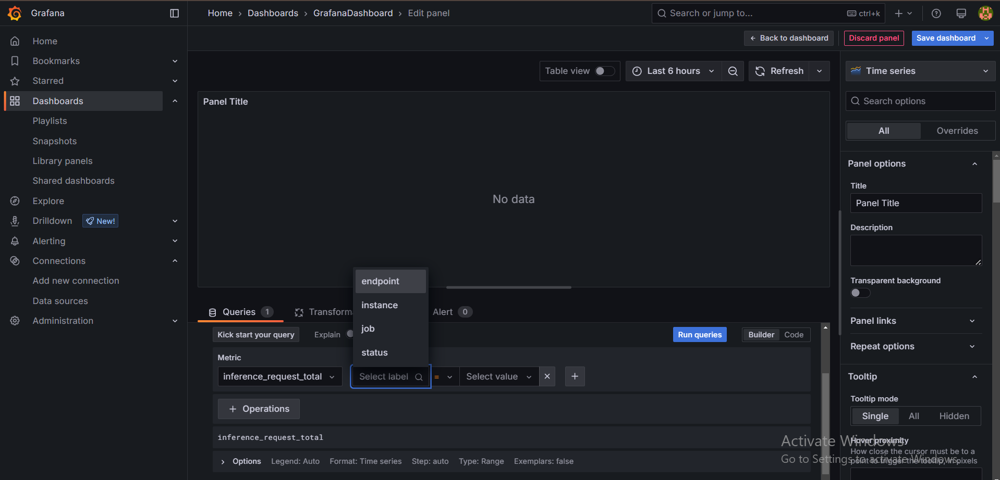
                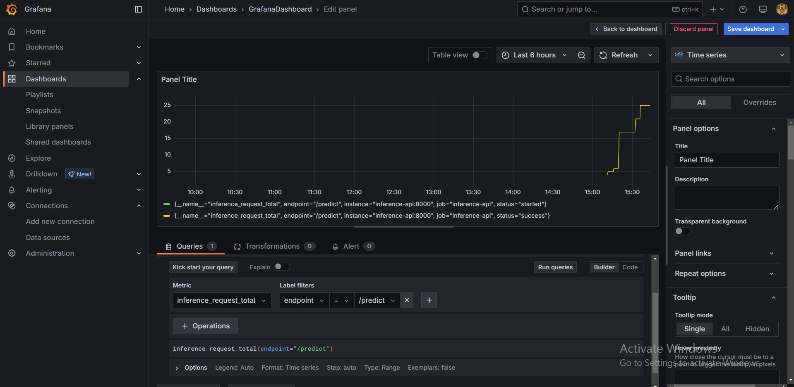

## 6. Các URLs quan trọng

| Dịch vụ             | URL                               | Thông tin đăng nhập (nếu có)             |
|----------------------|-----------------------------------|------------------------------------------|
| MinIO Console        | `http://localhost:9001`           | `minioadmin` / `minioadmin`              |
| Kafka Control Center | `http://localhost:9021`           | -                                        |
| Apache Airflow       | `http://localhost:8080`           | `admin` / `admin`                        |
| Spark Master UI      | `http://localhost:9090`           | -                                        |
| Redis (CLI)          | `docker exec -it redis redis-cli` | -                                        |
| Ray Dashboard        | `http://localhost:8265`           | -                                        |
| MLflow UI            | `http://localhost:5001`           | -                                        |
| Inference API (Docs) | `http://localhost:8000/docs`      | -                                        |
| Prometheus UI        | `http://localhost:9091`           | -                                        |
| Grafana UI           | `http://localhost:3000`           | `admin` / `admin`                        |


## 7. Thành viên (Contributors)

*   [Vũ Thị Minh Thư - 22028116](https://github.com/VuThiMinhThu2004)
*   [Tăng Vĩnh Hà - 22028129](https://github.com/tangha1004)
*   [Nguyễn Hữu Thế - 22028155](https://github.com/thebeo2004)
*   [Hoàng Kim Chi - 22028046](https://github.com/Chi290804)  
*   [Phạm Công Minh - 22028239](https://github.com/minh-1129)  

---
*Tài liệu này được cập nhật lần cuối vào: May 23, 2025*
