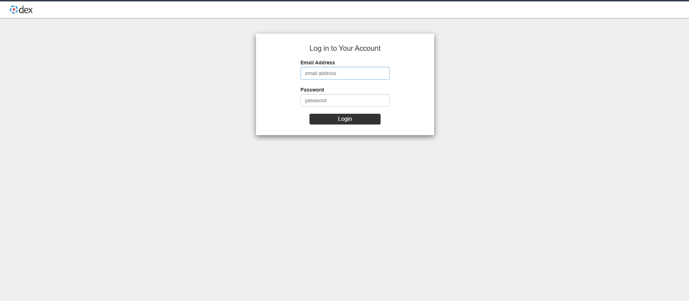
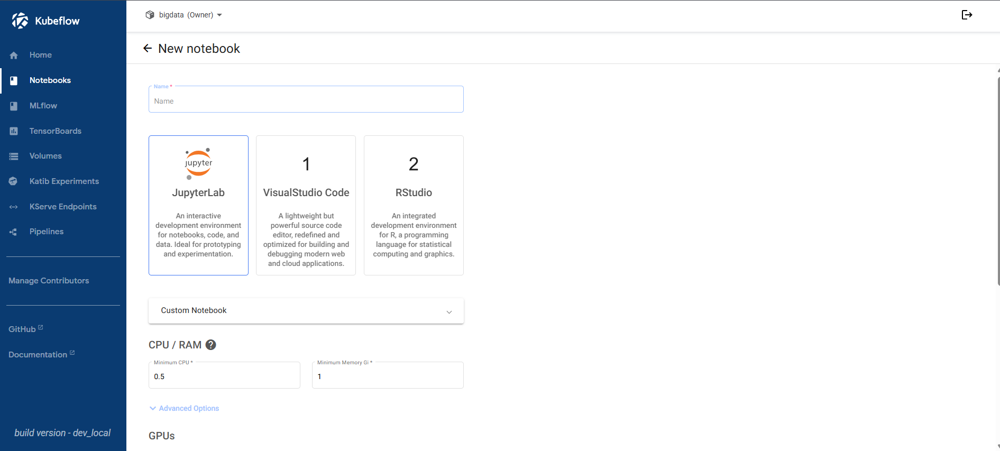
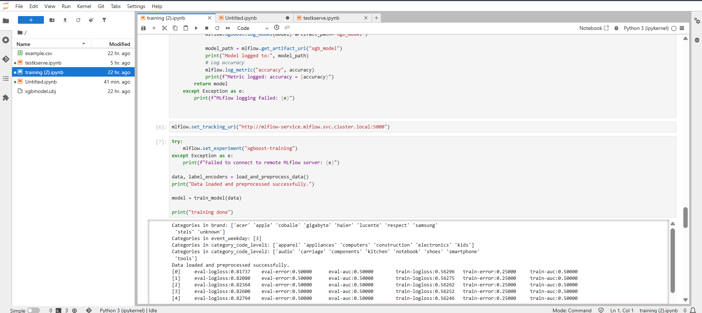
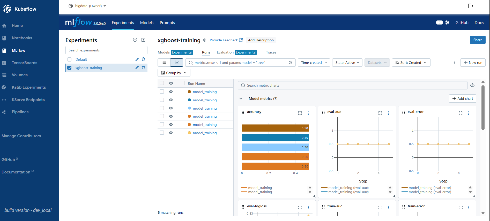
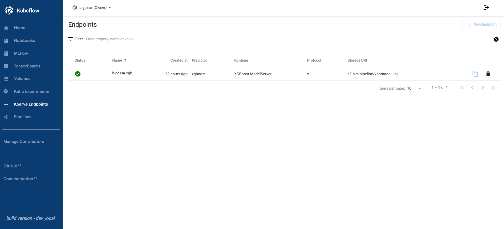

# Hướng dẫn triển khai và sử dụng Kubeflow tích hợp MLflow

Trong dự án, Kubeflow được triển khai trên 1 VM instance trên Google Cloud có public IP với thông số:
*   **OS**: Ubuntu 22.04
*   **RAM**: 32GB
*   **CPU**: 8 vCPUs
*    `Allow https connection`
*    `Allow http conection`
*   **Port**: 8080 
## Yêu cầu
*   **Kubectl**:
*   **Kind**: 
*   **Kustomize**: 
*   **Docker**:
*   **Git**:
*   **Minio Client (mc)**:

## Hướng dẫn triển khai
### Cài đặt yêu cầu
1. Tải kubectl
```bash
    curl -LO "https://dl.k8s.io/release/$(curl -L -s https://dl.k8s.io/release/stable.txt)/bin/linux/amd64/kubectl"
    sudo install -o root -g root -m 0755 kubectl /usr/local/bin/kubectl
```
2. Tải kind
```bash
    [ $(uname -m) = x86_64 ] && curl -Lo ./kind https://kind.sigs.k8s.io/dl/v0.29.0/kind-linux-amd64
    chmod +x ./kind
    sudo mv ./kind /usr/local/bin/kind  
```
3. Tải kustomize
```bash
    curl -s "https://raw.githubusercontent.com/kubernetes-sigs/kustomize/master/hack/install_kustomize.sh"  | bash
    sudo install -o root -g root -m 0755 kustomize /usr/local/bin/kustomize
```
4. Tải docker
```bash
    sudo apt-get update
    sudo apt-get install ca-certificates curl
    sudo install -m 0755 -d /etc/apt/keyrings
    sudo curl -fsSL https://download.docker.com/linux/ubuntu/gpg -o /etc/apt/keyrings/docker.asc
    sudo chmod a+r /etc/apt/keyrings/docker.asc

    echo \
    "deb [arch=$(dpkg --print-architecture) signed-by=/etc/apt/keyrings/docker.asc] https://download.docker.com/linux/ubuntu \
    $(. /etc/os-release && echo "${UBUNTU_CODENAME:-$VERSION_CODENAME}") stable" | \
    sudo tee /etc/apt/sources.list.d/docker.list > /dev/null
    
    sudo apt-get update

    sudo apt-get install docker-ce docker-ce-cli containerd.io docker-buildx-plugin docker-compose-plugin
```

5. Setup docker
```bash
    sudo usermod -aG docker <tên user>
    newgrp docker
```

6. Tải MinIO Client
```bash
curl https://dl.min.io/client/mc/release/linux-amd64/mc \
  --create-dirs \
  -o $HOME/minio-binaries/mc

chmod +x $HOME/minio-binaries/mc
```
### Setup Kubeflow
1. Config `inotify` do số lượng file Kubeflow cần theo dõi vượt quá giới hạn mặc định của Linux
```bash
    sudo sysctl fs.inotify.max_user_instances=2280
    sudo sysctl fs.inotify.max_user_watches=1255360
```

2. Tạo kind cluster (hoặc sử dụng cluster k8s có sẵn)
```bash
cat <<EOF | kind create cluster --name=kubeflow --config=-
kind: Cluster
apiVersion: kind.x-k8s.io/v1alpha4
nodes:
- role: control-plane
  image: kindest/node:v1.32.0@sha256:c48c62eac5da28cdadcf560d1d8616cfa6783b58f0d94cf63ad1bf49600cb027
  kubeadmConfigPatches:
  - |
    kind: ClusterConfiguration
    apiServer:
      extraArgs:
        "service-account-issuer": "https://kubernetes.default.svc"
        "service-account-signing-key-file": "/etc/kubernetes/pki/sa.key"
EOF
```
3. Config kind cluster
```bash
kind get kubeconfig --name kubeflow > /tmp/kubeflow-config
export KUBECONFIG=/tmp/kubeflow-config

docker login

kubectl create secret generic regcred \
    --from-file=.dockerconfigjson=$HOME/.docker/config.json \
    --type=kubernetes.io/dockerconfigjson
```
4. Cài đặt Kubeflow

Cách sau không được khuyến nghị do đây là bản dev của Kubeflow, nên cài theo release chính thức của Kubeflow để tránh các lỗi vặt (ví dụ như lỗi kiểu nthread trong xgbserver của mã nguồn bên trong KServe làm lỗi InferenceService tạo từ file model xgboost mà nhóm gặp phải do phiên bản KServe 15.0.0 mà phiên bản Kubeflow được tải sử dụng chưa xử lý)

```bash
git clone https://github.com/kubeflow/manifests.git
cd manifests

while ! kustomize build example | kubectl apply --server-side --force-conflicts -f -; do echo "Retrying to apply resources"; sleep 20; done
```

Đợi các pod của Kubeflow đều Ready, có thể kiểm tra dùng:
```bash
kubectl get pods -n kubeflow
```

5. Config để Kubeflow có thể được truy cập qua HTTP
Để truy cập Kubeflow qua HTTP sau khi expose port, cần tắt `Secure Cookies` của Kubeflow bằng cách sửa biến `APP_SECURE_COOKIES` từ "true" thành "false" trong env của các deployment K8s liên quan đến web app của Kubeflow. Nếu không chỉnh thì sẽ gặp lỗi `403: Could not find CSRF cookie xsrf token in the request` khi thực hiện các chức năng qua web kubeflow. Cần sửa trong 3 deployment sau.

```bash
kubectl edit deploy jupyter-web-app-deployment -n kubeflow
kubectl edit deploy volumes-web-app-deployment -n kubeflow
kubectl edit deploy kserve-models-web-app -n kubeflow
```

Với `jupyter-web-app` và `volumes-web-app`thì có thể tìm thấy biến `APP_SECURE_COOKIES` ở phần env
```bash
- name: APP_SECURE_COOKIES
  value: "true" -> sửa thành "false"
```
Với `kserve-models-web-app` thì không có sẵn do load env từ config, tự thêm env để ghi đè.
```bash
    spec:
      containers:
      - env:
        - name: APP_SECURE_COOKIES
          value: "false"
        envFrom:
        - configMapRef:
            name: kserve-models-web-app-config

```

6. Forward istio gateway đến port 8080 để có thể truy cập Kubeflow Dashboard qua localhost:8080 (với admin) và http://<external-ip>:8080 (với người dùng khác)

user mặc định là `user@example.com` với mật khẩu `12341234`, có thể sửa theo hướng dẫn ở https://github.com/kubeflow/manifests

```bash
kubectl port-forward svc/istio-ingressgateway -n istio-system 8080:80 --address=0.0.0.0
```

### Set up MLflow và tích hợp vào Kubeflow Dashboard

MLflow cần database và s3 storage tuy nhiên Kubeflow đã có sẵn MinIO nên chỉ setup Postgresql để tiết kiệm resource. Nếu cần có thể tự triển khai MinIO riêng.

Cách sau đây chỉ tạo 1 MLflow Server cho tất cả người dùng dùng chung do giới hạn tài nguyên (vcpu). 

Để tạo Mlflow riêng cho mỗi người dùng cần viết thêm script mỗi khi có thêm namespace mới sẽ tự động triển khai mlflow server mới trong namespace đó, tạo user, bảng mới trong postgres và triển khai gateway để route tới MLflow của mỗi người dùng trước khi tích hợp vào Kubeflow.


1. Tạo namepspace mlflow
```bash
kubectl create namespace mlflow
```
2. Deploy posgresql trong k8s
```bash
kubectl apply -f mlflow/postgresql-deployment.yaml
```

3. Tìm tên pod postgresql, tạo user, db, config
```bash
kubectl get pods -n mlflow
kubectl exec -it -n mlflow mlflow-postgres-85f9bd656c-nbj4w -- bash
psql -U postgres
```

```bash
CREATE USER mlflow WITH PASSWORD 'password';
CREATE DATABASE mlflow_db;
GRANT ALL PRIVILEGES ON DATABASE mlflow_db TO mlflow;
\c mlflow_db
GRANT ALL ON SCHEMA public TO mlflow;
GRANT ALL PRIVILEGES ON ALL TABLES IN SCHEMA public TO mlflow;
GRANT ALL PRIVILEGES ON ALL SEQUENCES IN SCHEMA public TO mlflow;
```
4. Tạo bucket `mlflow-bucket` cho MLflow trong MinIO
MinIO trong Kubeflow nằm trong namespace `kubeflow`, access key là `minio` và secret key là `minio123`

```bash
kubectl port-forward svc/minio-service -n kubeflow 9000:9000
 
export PATH=$PATH:$HOME/minio-binaries/
mc alias set minio-kf http://localhost:9000 minio minio123
mc mb minio-kf/mlflow-bucket
```

5. Build Docker image cho MLflow
```bash 
docker build -t prezaei/mlflow-custom:v1.0 ./mlflow
```

6. Deploy MLflow
```bash
kubectl apply -f mlflow/mlflow-deployment.yaml
```
Có thể forward ra port 5000 vào localhost:5000 để kiểm tra trước khi tích hợp
```bash
kubectl port-forward -n mlflow svc/mlflow-service 5000:5000
```

7. Tạo virture service để tích hợp mlflow service vào kubeflow gateway
```bash
kubectl apply -f mlflow/virture-service-mlflow.yaml
```

8. Chỉnh sửa UI dashboard thêm tab MLflow
```bash
kubectl edit cm centraldashboard-config -n kubeflow
```
Thêm config vào section `menuLinks`
```bash
{
    "type": "item",
    "link": "/mlflow/",
    "text": "MLflow",
    "icon": "book"
},
```

Sau khi thêm chạy lệnh sau để dashboard reload
```bash
kubectl rollout restart deploy centraldashboard -n kubeflow
```

### Thêm người dùng
Kubeflow mặc định sử dụng **Dex** để quản lý đăng nhập 

Giả sử người dùng có mail là `bigdata@gmail.com` và cần tạo tài khoản và namespace mới trong kubeflow cho họ.

1. Thêm người dùng vào dex
```bash
kubectl edit configmap dex -n auth
```
Thêm thông tin người dùng (email, user) và mật khẩu đã hash (base64) vào phần `static passwords', ở đây sử dụng luôn hash DEX_USER_PASSWORD từ env
```bash
    staticPasswords:
    - email: user@example.com
      hashFromEnv: DEX_USER_PASSWORD
      username: user
      userID: "15841185641784"
    - email: bigdata@gmail.com
      hashFromEnv: DEX_USER_PASSWORD
      username: bigdata
    - email: 
      hash:
      emailname:
```

2. Tạo profile mới cho Kubeflow

Truy cập https://www.kubeflow.org/docs/components/central-dash/profiles/ để biết thêm chi tiết về các role và sửa file `new_profile.yaml`

```bash
kubectl apply -f config/new_profile.yaml
```

3. Config minio để có thể kết nối kserve trong namespace
```bash
kubectl apply -f config/minio-kserve-secret.yaml
```

## Sử dụng
Truy cập port `8080` của external IP của kubeflow server hoặc  `localhost:8080` nếu triển khai ở local để sử dụng Kubeflow

Đăng nhập Dex sử dụng user và mật khẩu đã config


Tạo notebook, tải dữ liệu training lên và train mô hình, track sử dụng mlflow, có thể tham khảo trong `/notebook/`



Quản lý experiment và track metric dùng mlflow


Tạo KServe endpoint từ mô hình thuộc namespace của người dùng


Sau khi tạo KServe API thực hiện theo hướng dẫn ở https://github.com/kserve/kserve/tree/master/docs/samples/istio-dex để test và tích hợp vào fastapi